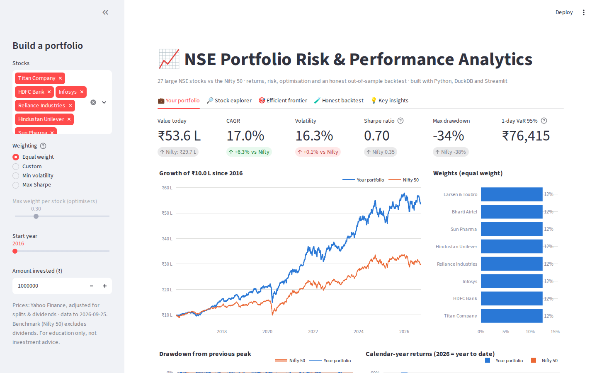
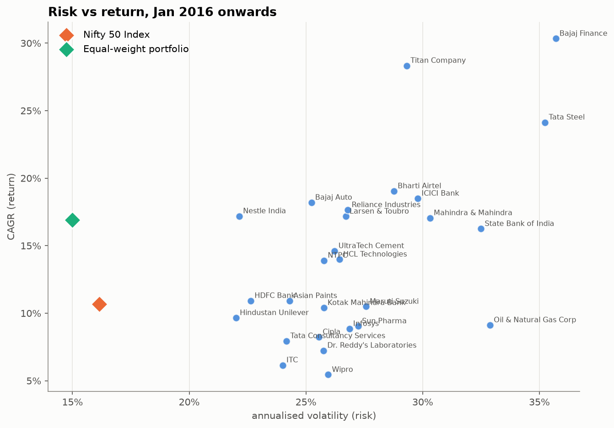
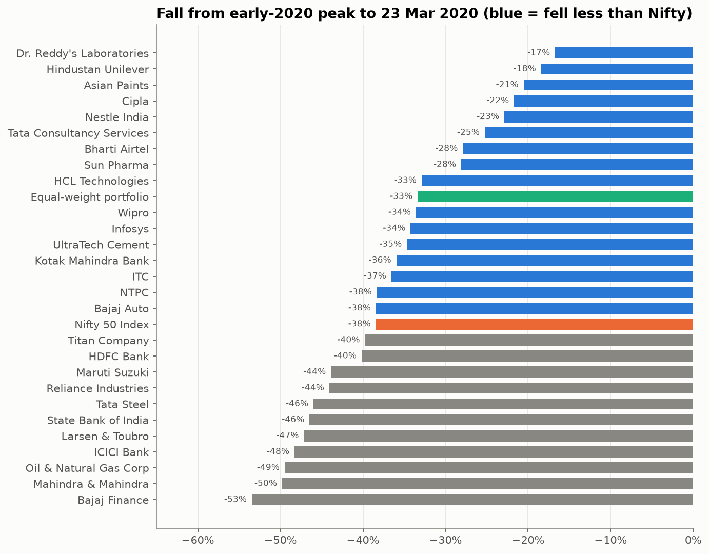
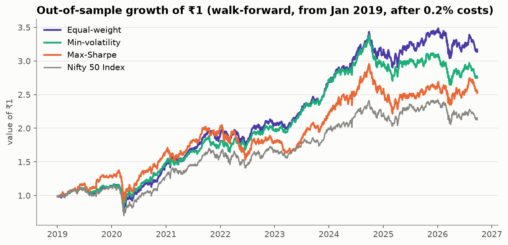
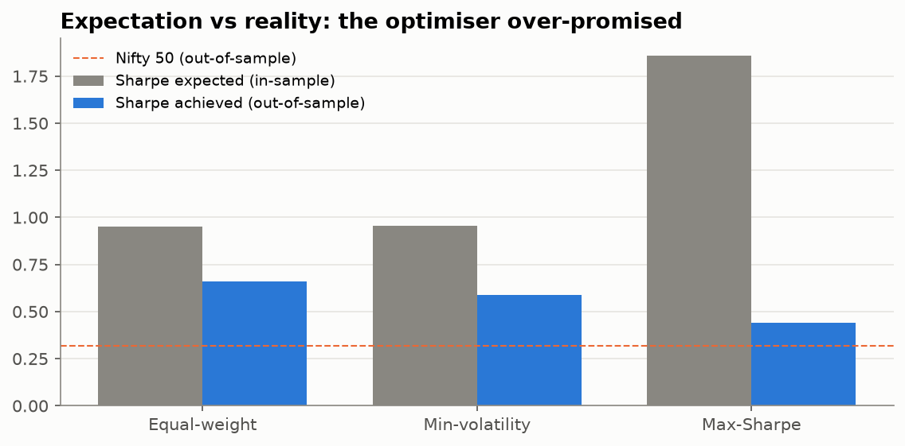

# NSE Portfolio Risk & Performance Analytics

**Automated risk & performance analytics on 10 years of daily prices for 27 large NSE stocks, benchmarked against the Nifty 50,**
from an automated data pipeline to risk metrics, portfolio optimisation, an honest out-of-sample backtest and a live dashboard.

**▶ Live dashboard: [nse-portfolio-adhiraj.streamlit.app](https://nse-portfolio-adhiraj.streamlit.app/)**



`Python` · `yfinance` · `SQL (DuckDB)` · `pandas` · `NumPy` · `SciPy` · `Matplotlib` · `Plotly` · `Streamlit` · `GitHub Actions`

---

## The questions
1. Which stocks and sectors delivered the best returns, and did they beat the Nifty 50?
2. How risky were they? How deep were the drawdowns, and what happened in the COVID crash?
3. Were the returns worth the risk?
4. Can optimisation build a better portfolio, and **does it still work on data it has never seen?**

## Key findings
*Snapshot: Jan 2016 – Sep 2026. The data refreshes daily, so live numbers drift slightly.*

| # | Finding | Evidence |
|---|---|---|
| 1 | **The Nifty 50 compounded at ~10.7%/yr** (₹1 → ~₹3); the arithmetic average overstates it by ~1 pt (volatility drag) | [Returns](notebooks/02_returns_performance.ipynb) |
| 2 | **16 of 27 stocks beat the index**, led by Bajaj Finance (~30%/yr), Titan (~28%), Tata Steel (~24%); **TCS, Infosys, ITC, Wipro lagged** | [Returns](notebooks/02_returns_performance.ipynb) |
| 3 | **Diversification cuts risk ~40%**: single stocks ~27% volatility vs ~16% for the index; ~10 stocks capture most of the benefit | [Risk](notebooks/03_risk_analysis.ipynb) · [Optimisation](notebooks/04_portfolio_optimisation.ipynb) |
| 4 | **Crashes are more common than bell curves assume**: 37 days beyond ±3σ vs 7 expected (5×) | [Risk](notebooks/03_risk_analysis.ipynb) |
| 5 | **COVID crash: Nifty −38% in 69 days**, recovered in ~7.5 months; low-beta defensives fell about half as much; **stock correlations jumped 0.22 → 0.60** | [Risk](notebooks/03_risk_analysis.ipynb) |
| 6 | **Best risk-adjusted stock: Titan (Sharpe 0.81)**, ahead of Bajaj Finance (0.77) despite lower returns; Nifty 0.35 | [Risk](notebooks/03_risk_analysis.ipynb) |
| 7 | **Optimisers overfit**: out of sample, max-Sharpe *expected* a Sharpe of 1.86 but *delivered* 0.44, the worst strategy | [Backtest](notebooks/04_portfolio_optimisation.ipynb) |
| 8 | **Simple wins**: equal-weight had the best out-of-sample Sharpe (0.66); min-volatility had the smallest drawdown (−29% vs −38%) | [Backtest](notebooks/04_portfolio_optimisation.ipynb) |

<p align="center">
  
  
</p>
<p align="center">
  
  
</p>

### The out-of-sample backtest (2019 – 2026)
Every January, each strategy chooses weights using **only the previous 3 years** of data, holds them for the year (weights drift with prices) and pays **0.2% trading costs**.

| Strategy | CAGR | Volatility | Max drawdown | Sharpe **expected** (in-sample) | Sharpe **achieved** (out-of-sample) |
|---|---:|---:|---:|---:|---:|
| Equal-weight | 16.0% | 15.7% | −33% | 0.95 | **0.66** |
| Min-volatility | 14.0% | 14.3% | **−29%** | 0.95 | 0.59 |
| Max-Sharpe | 12.8% | 17.8% | −35% | **1.86** | 0.44 |
| Nifty 50 | 10.3% | 17.3% | −38% | – | 0.32 |

**Takeaway:** risk (covariance) is fairly predictable, but expected returns are not. Robust portfolios should focus on diversification and risk, not on fitted return forecasts.

📄 One-page summary: [reports/executive_summary.md](reports/executive_summary.md)

---

## How it's built
```
config/universe.csv (27 stocks + Nifty 50)
   │  src/fetch_prices.py: Yahoo Finance API, adjusted prices
   ▼
data/raw/prices.parquet (committed snapshot) ──► DuckDB · raw
   │  src/build_models.py
   ▼
staging.clean_prices   phantom holiday rows removed, common trading calendar
marts.daily_returns / marts.annual_returns                  ✔ 6 automated data tests
   │
   ├──► notebooks/ (analysis) using src/metrics.py + src/optimize.py
   └──► dashboard/app.py (Streamlit, same SQL + modules) ──► deployed on Streamlit Cloud

GitHub Actions, weekdays 19:00 IST: re-download prices → commit snapshot → dashboard redeploys
```

### Data quality
Seven checks, all documented in the [data quality report](reports/data_quality_report.md). Highlights:
- **Adjusted prices** for splits, bonuses and dividends (ITC: 1.28× price growth vs 1.88× total return).
- **Provider-filled holiday rows** (zero volume, unchanged price) removed. An automated test caught a glitch day where 26 stocks had fake rows, fixed with a common trading calendar.
- **All 14 extreme daily moves (>±15%) verified as real events** (COVID, elections, SBI recapitalisation), confirming there are no split errors.
- **Caveats stated up front:** survivorship bias (today's large caps) and a benchmark that excludes dividends.

### Analysis notebooks
| Notebook | Covers |
|---|---|
| [01 · Data pipeline & quality](notebooks/01_data_pipeline_quality.ipynb) | adjusted prices, trading calendar, data checks, biases |
| [02 · Returns & performance](notebooks/02_returns_performance.ipynb) | compounding, CAGR, calendar-year heatmap, sectors, rolling returns |
| [03 · Risk](notebooks/03_risk_analysis.ipynb) | volatility, fat tails, drawdowns, beta, VaR/CVaR, Sharpe/Sortino, COVID case study |
| [04 · Optimisation & backtest](notebooks/04_portfolio_optimisation.ipynb) | correlation, diversification, efficient frontier, walk-forward backtest |

---

## Run it yourself
```bash
git clone https://github.com/adhirajsinha1/nse-portfolio-analytics.git
cd nse-portfolio-analytics
python3 -m venv .venv && source .venv/bin/activate
pip install -r requirements.txt
python src/fetch_prices.py                   # download fresh prices
python src/build_models.py                   # clean data, build tables, run tests
python -m streamlit run dashboard/app.py     # launch the dashboard
```
To analyse different stocks, edit `config/universe.csv` and re-run the pipeline.

## Project structure
```
config/        stock universe
data/raw/      price snapshot (Parquet), refreshed automatically
sql/           cleaning models, analysis tables and data tests
src/           pipeline scripts, metrics.py (risk), optimize.py (optimisation & backtest), chart style
notebooks/     analysis notebooks
dashboard/     Streamlit app
reports/       data quality report, executive summary, charts
.github/       scheduled data-refresh workflow
```

## Author
**Adhiraj Sinha**, undergraduate student at VIT Chennai (2023–2027), interested in data analytics and finance.
[GitHub](https://github.com/adhirajsinha1) · Also see: [Olist E-commerce Analytics](https://github.com/adhirajsinha1/olist-analytics)

*Data: Yahoo Finance via yfinance. Educational project, **not investment advice**.*
